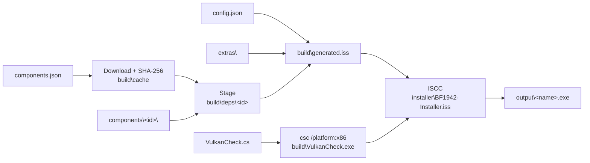

# Technical overview

How the build works and what the generated installer does. For setup and configuration, see the [README](../README.md).

---

## 1. Build pipeline (`build.ps1`)



1. **Config.** `config.json` is created from `config.example.json` on the first build. An empty or invalid `appId` is replaced with a new GUID, which is saved back to the file.
2. **Inno Setup.** The script finds ISCC on `PATH`, through the Inno Setup uninstall key (HKCU or HKLM), or in the default install folders. The `.iss` itself refuses to compile on versions older than 6.4, because `ExecAndCaptureOutput` and array literals are used in `[Code]`.
3. **Components.** Each entry in `components.json` is downloaded to `build\cache`. Pinned files are checked against their SHA-256. Unpinned files, such as the latest VC++ redistributable, must carry a valid Authenticode signature from the named signer. Each file is then staged into `build\deps\<id>`:

   | Type | Handling |
   |---|---|
   | `file` | Copied as-is |
   | `zip` | Selected entries extracted in memory (avoids antivirus locks on the archive) |
   | `tar.gz` | Selected entries extracted with the built-in `tar.exe` |
   | `directx-sfx` | `directx_Jun2010_redist.exe /Q /T:<dir>` |

   Afterwards, `components\<id>\*` (the tracked configs and LGPL libraries) is copied over the staged files. Ids in `exclude` are skipped; excluding a required component, or a component another one `requires`, stops the build.
4. **Extras.** Each path listed under `extras` in `components.json` is looked up in `extras\`. A file that differs from the tested SHA-256 produces a warning but is still used.
5. **VulkanCheck.** It is compiled with the .NET Framework 4 `csc.exe` (x86) whenever the source is newer than the exe.
6. **`build\generated.iss`.** This file holds the settings (`AppIdGuid`, `InstallerTitle`, `ServerAddress`, …) plus these defines for every component:
   - `Has_<id>` (0/1)
   - `Ver_<id>`
   - `Url_<id>`
   - `File_<id>`

   Text values are sanitised: quotes become typographic quotes so they are safe inside ISPP and Pascal strings.
7. **Compile.** `ISCC /Q installer\BF1942-Installer.iss`, with `/DQUICK` when `-Quick` is used (no game files). The script then prints the size and SHA-256 of the result.

Everything that depends on an optional component is wrapped in `#if Has_<id>` in the `.iss`, so a missing or excluded component leaves no trace in the installer.

---

## 2. Renderer detection (DXVK vs dgVoodoo2)

`VulkanCheck.exe` is extracted to `{tmp}` and never installed. It is 32-bit on purpose, because BF1942 is 32-bit and DXVK will use the 32-bit Vulkan loader (`SysWOW64\vulkan-1.dll`). It calls `vulkan-1.dll` directly (P/Invoke) and returns `0` when at least one non-CPU device offers all of these:

- Vulkan API version **1.3** or higher
- `VK_EXT_robustness2` or `VK_KHR_robustness2`
- `robustBufferAccess`

Anything else means dgVoodoo2. The check's output is shown on the *Ready to Install* page and written to the setup log. `Setup.exe /RENDERER=dxvk` or `/RENDERER=dgvoodoo` skips the check.

| Renderer | Installed files |
|---|---|
| DXVK | `d3d8.dll`, `d3d9.dll` (from the release's `x32\` folder), `dxvk.conf` |
| dgVoodoo2 | `D3D8.dll` (from the release's `MS\x86\` folder), `dgVoodoo.conf` |

---

## 3. What the installer changes on the PC

### Files
- **Game:** the game folder is copied to `{app}`, without `Tools\`. When font extras exist, `Mods\bf1942\Archives\Font.rfa` comes from the chosen *Font* component instead.
- **Fixes:** BF42++ (`dsound.dll`, `bf42++BlackScreen.exe`, `bf42++.ini`), the chosen renderer, and HRTF (`dsound_next.dll`, `dsoal-aldrv.dll`, `alsoft.ini`) go next to `BF1942.exe`. The LGPL license texts go to `{app}\Licenses`.

### Registry (32-bit view: `HKLM\SOFTWARE\WOW6432Node\…` on 64-bit Windows)

| Key / value | When | Removed on uninstall |
|---|---|---|
| `Electronic Arts\EA GAMES\Battlefield 1942\GAMEDIR` = `{app}` | Always | The value, then any empty parent keys |
| `Electronic Arts\EA GAMES\Battlefield 1942\ergc` (default value) = random `[A-Z0-9]{22}` | `generateSerial` is on and no valid serial exists | Only if the installer created it |
| `<registryStateKey>\Renderer`, `DataField42`, `RichPresence`, `PunkBuster` | Always / per component | The whole key |

### Display mode

The primary monitor's resolution and refresh rate are read with `GetDeviceCaps`, which ignores Windows display scaling:
- width from `DESKTOPHORZRES`
- height from `DESKTOPVERTRES`
- refresh rate from `VREFRESH`, or 60 Hz if unavailable

Every `Video*.con` file under `{app}\Mods` gets:

```
game.setGameDisplayMode <W> <H> 32 <Hz>
```

When Borderless1942 is chosen, `VideoDefault.con` also gets `renderer.setFullScreen 0`.

### Shortcuts

| Shortcut | Arguments |
|---|---|
| Battlefield 1942 | `+restart 1` if *Skip intro* is ticked |
| *serverShortcutName* | `+restart 1 +joinServer <serverAddress>` (only when `serverAddress` is set) |
| Battlefield 1942 (Borderless) | `-width <W> -height <H>`, plus `+restart 1` if *Skip intro* is ticked |

### Install folder

With `appendEAGamesFolder`, the chosen folder is normalised to `…\EA Games\Battlefield 1942`. For example, `D:\Games` becomes `D:\Games\EA Games\Battlefield 1942`.

---

## 4. Install order (`[Run]`)

1. `dism /online /enable-feature /featurename:DirectPlay /all`: only if the WMI `Win32_OptionalFeature` InstallState is not 1. Uses the 64-bit `dism` on x64.
2. `DXSETUP.exe /silent`: only if any June 2010 x86 DLL is missing from `SysWOW64`.
3. `VC_redist.x86.exe /install /quiet /norestart`: only if the installed x86 runtime is older than the bundled one. If the registry says it is current but `msvcp140.dll` or `vcruntime140.dll` is missing from `SysWOW64`, it runs with `/repair` instead. If the DLLs are still missing afterwards, the user is told how to repair it by hand.
4. `sdbinst -q BF1942.sdb`: Compatibility Profile.
5. DataField42 setup: `/SILENT /SUPPRESSMSGBOXES /NORESTART /SP- /DIR="{app}"`.
6. .NET 8 Desktop Runtime: only if no complete 8.0.x runtime is found. A version only counts when `Microsoft.WindowsDesktop.App.deps.json` and the matching `Microsoft.NETCore.App` files exist and a `host\fxr\*\hostfxr.dll` is present. If the bundled version is registered but incomplete, it runs with `/repair`. If the runtime is still incomplete afterwards, the user is told how to repair it by hand.
7. `msiexec /i` Battlefield Rich Presence, `/qn`.
8. `Punkbuster42.exe`, which is interactive. Setup then **waits for `pbsvc.exe` to exit**, because Punkbuster42 leaves its *PunkBuster Services* window open.

---

## 5. Uninstall

| Step | Action |
|---|---|
| Compatibility Profile | `sdbinst -q -u BF1942.sdb` |
| PunkBuster setup window | Any `pbsvc.exe` still running from `{app}` is closed |
| Firewall | Every rule whose program is under `{app}\` is removed, such as the auto-created `bf1942` TCP/UDP rules |
| DataField42 | Its own uninstaller runs with `/VERYSILENT`. The uninstaller waits until its uninstall entry is gone. |
| Rich Presence | `msiexec /x {ProductCode} /qn` |
| "Punkbuster for Battlefield 1942" | Its uninstall key and Start menu folder are deleted, but only if the entry points into `{app}` |
| PunkBuster Services | Removed **only when no other PunkBuster game is found** (see below) |
| Files and registry | `{app}` is deleted recursively, then the registry values listed in §3 are removed |

DirectX, VC++, .NET and DirectPlay are left installed because other software may use them.

### Detecting other PunkBuster games

A game counts as a PunkBuster game if its folder, other than `{app}`, contains `pb\pbcl.dll`. The uninstaller looks in:

- The uninstall entries under HKLM64, HKLM32 and HKCU: `DisplayName`, `InstallLocation` and the folder of `UninstallString`. Any remaining *"Punkbuster for …"* entry also counts.
- `GAMEDIR` / `Install Dir` under `HKLM32\SOFTWARE\Electronic Arts[\EA GAMES]\*`.
- Subfolders of the install's parent folder, `C:\EA Games`, `Program Files (x86)\EA Games`, `Program Files (x86)\Electronic Arts` and `Program Files\EA Games`.
- `steamapps\common\*` in every Steam library listed in `libraryfolders.vdf`.

If none is found, the uninstaller:
1. Runs `sc stop` and `sc delete` on PnkBstrA and PnkBstrB.
2. Deletes `PnkBstrA.exe`, `PnkBstrB.exe`, `PnkBstrK.sys` and `pbsvc.exe` from `SysWOW64`, retrying for up to 10 seconds.
3. Removes the `PunkBusterSvc` uninstall key.

`pbsvc -u` and Punkbuster42's `Uninstal.exe` are never run. Neither can tell whether other games are installed, and both show windows. If a PunkBuster game is missed, it reinstalls the services the next time it runs.

---

## 6. Testing

| Scenario | How |
|---|---|
| Script and components only | `.\build.ps1 -Quick` |
| Force a renderer | `Setup.exe /RENDERER=dxvk` or `/RENDERER=dgvoodoo` |
| dgVoodoo2 path | A VM without a Vulkan 1.3 GPU, or `/RENDERER=dgvoodoo` |
| 32-bit | A 32-bit Windows 10 VM: Borderless1942 and Rich Presence must be hidden |
| Logs | Setup: `%TEMP%\Setup Log YYYY-MM-DD #NNN.txt`. Uninstall: `unins000.exe /LOG="C:\uninstall.log"` |
| Clean uninstall | Compare registry exports and firewall rules before the install and after the uninstall |
