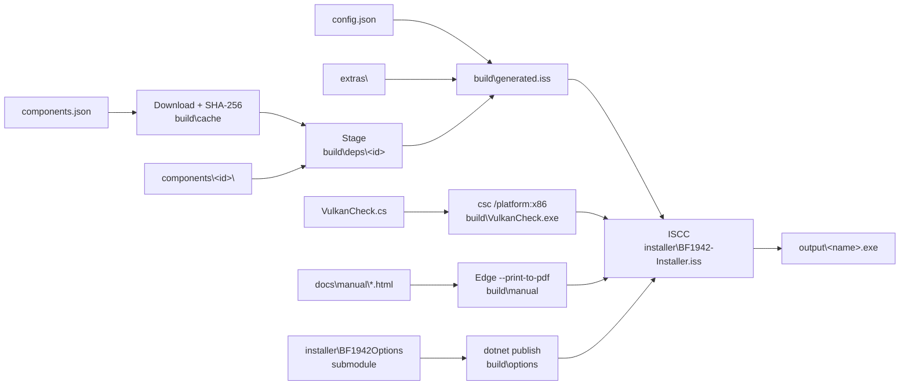

# Technical overview

How the build works and what the generated installer does. For setup and configuration, see the [README](../README.md).

---

## 1. Build pipeline (`build.ps1`)


```mermaid
flowchart LR
    A[config.json] --> G
    B[components.json] --> D[Download + SHA-256<br/>build\cache]
    D --> S[Stage<br/>build\deps\&lt;id&gt;]
    C[components\&lt;id&gt;\] --> S
    E[extras\] --> G
    V[VulkanCheck.cs] --> VC[csc /platform:x86<br/>build\VulkanCheck.exe]
    M[docs\manual\*.html] --> P[Edge --print-to-pdf<br/>build\manual]
    AP[installer\BF1942Options<br/>submodule] --> OP[dotnet publish<br/>build\options]
    S --> G[build\generated.iss]
    G --> I[ISCC<br/>installer\BF1942-Installer.iss]
    VC --> I
    P --> I
    OP --> I
    I --> O[output\&lt;name&gt;.exe]
```

1. **Config.** `config.json` is created from `config.example.json` on the first build. An empty or invalid `appId` is replaced with a new GUID, which is saved back to the file.
2. **Inno Setup.** Builds use the latest Inno Setup 7.x. Unless `-NoInnoUpdate` is passed, the script runs `winget install` (if Inno Setup 7 is missing) or `winget upgrade` for `JRSoftware.InnoSetup.7`. winget lists each major version as a separate package, so this never moves to a new major version by itself. "No update available" is not an error, and a failed update only prints a warning (the winget output goes to `build\build.log`). The script then finds ISCC through the `Inno Setup 7` uninstall key (HKCU or HKLM), in the default install folders, or on `PATH` (only if its banner says Inno Setup 7). The `.iss` itself refuses to compile on versions older than 7.0. Moving to a new major version means changing `$InnoMajor`, `$InnoWingetId` and `$MinInno` in `build.ps1` and the version check at the top of the `.iss`.
3. **Components.** Each entry in `components.json` is downloaded to `build\cache`. Pinned files are checked against their SHA-256. Unpinned files must carry a valid Authenticode signature from the named signer (`signedBy`, matched against the certificate's CN or O); for the always-latest VC++ redistributable from `aka.ms` that is the only check. A download with a `resolve` block is resolved before it is fetched: for `dotnet8`, `build.ps1` reads `https://builds.dotnet.microsoft.com/dotnet/release-metadata/8.0/releases.json`, takes the `latest-release` entry's `windowsdesktop` `win-x64` installer and uses its url, file name and SHA-512, so every build ships the current 8.0.x patch (the channel is fixed, so it cannot jump to another major version). The resolved version also becomes `Ver_dotnet8` in `generated.iss`, which the installer uses for its repair check. If the feed is unreachable, the pinned `url`/`sha256` are used instead, and the build warns when the channel is near or past its end-of-support date. A component with `checkLatest` (an `owner/repo`, currently Borderless1942) is still downloaded from its pinned url, but the build also reads `https://api.github.com/repos/<owner/repo>/releases/latest` and warns when that release is newer than `version`; an unreachable API is only noted. Each file is then staged into `build\deps\<id>`:

   | Type | Handling |
   |---|---|
   | `file` | Copied as-is |
   | `zip` | Selected entries extracted in memory (avoids antivirus locks on the archive) |
   | `tar.gz` | Selected entries extracted with the built-in `tar.exe` |
   | `directx-sfx` | `directx_Jun2010_redist.exe /Q /T:<dir>` |

   Afterwards, `components\<id>\*` (the tracked configs and LGPL libraries) is copied over the staged files. Ids in `exclude` are skipped; excluding a required component, or a component another one `requires`, stops the build.
4. **Extras.** Each path listed under `extras` in `components.json` is looked up in `extras\`. A file that differs from the tested SHA-256 produces a warning but is still used.
5. **VulkanCheck.** It is compiled with the .NET Framework 4 `csc.exe` (x86) whenever the source is newer than the exe.
6. **`build\generated.iss`.** This file holds the settings (`AppIdGuid`, `InstallerTitle`, `ServerAddress`, …) plus these defines for every component:
   - `Has_<id>` (0/1)
   - `Ver_<id>`
   - `Url_<id>`
   - `File_<id>`

   Text values are sanitised: quotes become typographic quotes so they are safe inside ISPP and Pascal strings.
7. **Troubleshooting guide and BF1942 Options.** Every page in `docs\manual` is printed to a PDF of the same name in `build\manual` with headless Microsoft Edge (a profile of its own in `build\edge-profile`). BF1942 Options is published from the `installer\BF1942Options` submodule ([BF1942-Installer-Options](https://github.com/AnomalousNicole/BF1942-Installer-Options)) with `dotnet publish` (.NET 10 SDK; `git submodule update --init` runs first if a clone left the folder empty) to `build\options`, with the game's `bf1942.ico` when there is one. `options.json` (`registryStateKey`, `generateSerial`, the server shortcut's name and address, `discordUrl`, and the separate programs the build includes) and `cover.bmp` (the largest `branding\WizardImage*.bmp`) are written next to it.
8. **Compile.** `ISCC installer\BF1942-Installer.iss`, with `/DQUICK` when `-Quick` is used (no game files). LZMA2 compresses the data in 256 MB blocks, one block thread per CPU thread as long as there is about 1.5 GB of free RAM for each (`LzmaThreads` in `generated.iss`). `-Smallest` instead compresses one stream with a 1 GB dictionary (`LzmaDict`), the largest a 32-bit Setup supports: about 5% smaller and 6-7 times slower. Measured with Inno Setup 7.1 on a 16-thread PC and 2,367 MB of game data plus extras: 4 threads took 231 s, 16 threads 136 s (identical output), and `-Smallest` 954 s (1,974 MB down to 1,871 MB). Dictionaries of 256 MB and 512 MB in a single stream saved only 7 MB and 62 MB.

   Before compiling, the script decides between a single `Setup.exe` (up to 4,200,000,000 bytes) and a split build (`/DSPAN`, `DiskSpanning=yes`, `.bin` slices of 2,100,000,000 bytes). It predicts the compressed size from `build\size-history.json` (this PC's earlier builds) or, before the first build, from the committed `size-seed.json`, whose ratios are measured on the MoonGamers build of this installer rather than on a build of the template and are therefore only an estimate. It compiles a second time only when a single file turns out not to fit. The progress bar follows the `Compressing:` lines of ISCC, whose paths Inno Setup 7 prints in extended-length form (`\\?\C:\...`); the script strips that prefix before looking up each file's size. The script then prints the size and SHA-256 of the result. At the very end (after `-Package7z`, if given) it writes the build time and the name, size and SHA-256 of every output file (`Setup.exe`, any `.bin` slices and `.7z` volumes) to `output\<OutputBase>_YYYY-MM-DD_hh.mm.ss_AM.txt` (or `_PM`), named after the time the installer was written on a 12-hour clock, and deletes the hash files of earlier builds because the output they describe has been overwritten.
9. **Log and stats.** Everything the script prints, the winget output and the full ISCC output of each compile attempt go to `build\build.log` (replaced on every run). After a successful build, `build\size-history.json` records the input and output size, whether the build was split, and the seconds per step.

Everything that depends on an optional component is wrapped in `#if Has_<id>` in the `.iss`, so a missing or excluded component leaves no trace in the installer.

**Packaging (`-Package7z`).** After the compile, `build.ps1` packs `Setup.exe` and any `.bin` slices into `output\<OutputBase>.7z` with `7z a -t7z -mx=<level>`, storing them as they are by default (`-PackageLevel 0`). A level above 0 adds `-m0=lzma2 -mmt=on`; on a 1.87 GB release build `-mx=9` took 69 s against 1.6 s for store and saved 0.01%, because the payload is already LZMA2-compressed. `-PackageVolumeSize` adds `-v<size>`, so the output becomes `<OutputBase>.7z.001`, `.002`, ... and every volume is listed with its own SHA-256. Both options imply `-Package7z`. 7-Zip is looked up **before** the compile, so a long build cannot fail at the last step: an installed `7z.exe` (`PATH`, `HKLM`/`HKCU` `SOFTWARE\7-Zip` `Path`, `%ProgramFiles%\7-Zip`) is preferred, otherwise the standalone `7zr.exe` from the `tools` entry in `components.json` is downloaded into `build\tools` and checked against its pinned SHA-256. The loose output files are kept; the archive's size and SHA-256 are printed and logged.

**Antivirus.** Downloading files, writing and silently running executables, compiling with `csc.exe`, reading the registry and force-deleting temporary files are all normal for this build, but together they match heuristics for malicious PowerShell. Some products (for example Bitdefender, `Heur.BZC.PZQ.Boxter.*`) therefore quarantine `build.ps1`, most often right after it has been created or changed. When you change the script, avoid adding more of these patterns than you need, and keep downloads pinned by SHA-256. See [Antivirus and build.ps1](../README.md#antivirus-and-buildps1) in the README for what users should do.

---

## 2. Renderer detection (DXVK vs dgVoodoo2)

Setup runs `VulkanCheck.exe` from `{tmp}`; the copy in `{app}\Options` is for BF1942 Options' **Check my graphics card**. It is 32-bit on purpose, because BF1942 is 32-bit and DXVK will use the 32-bit Vulkan loader (`SysWOW64\vulkan-1.dll`). It calls `vulkan-1.dll` directly (P/Invoke) and returns `0` when at least one non-CPU device offers all of these:

- Vulkan API version **1.3** or higher
- `VK_EXT_robustness2` or `VK_KHR_robustness2`
- `VK_KHR_maintenance5` (core in Vulkan 1.4)
- `VK_KHR_pipeline_library` and `VK_KHR_swapchain`
- `robustBufferAccess`
- at least 256 bytes of push constants (`maxPushConstantsSize`)

These match the adapter checks in DXVK 2.7.1 (`dxvk_device_info.cpp`). When DXVK finds no adapter it only writes `No adapters found` to `BF1942_d3d9.log` and the game shows a black screen, so a GPU that misses any of them must get dgVoodoo2. AMD Polaris (RX 400/500) is the known case: its drivers report Vulkan 1.3 but have no `maintenance5`.

It returns `1` when no device does, which means dgVoodoo2. If the check fails (the helper can't be extracted or started, which is usually an antivirus blocking it, or it returns `2`), Setup asks the player which renderer to install, defaulting to DXVK (silent installs take the default). The check's output is shown on the *Ready to Install* page and written to the setup log. `Setup.exe /RENDERER=dxvk` or `/RENDERER=dgvoodoo` skips the check. Installing over a game folder that runs dgVoodoo2 (its `d3d8.dll` is identical to the library copy) keeps dgVoodoo2 without the check: it was picked in BF1942 Options or by an earlier Setup, and switching to DXVK could bring a black screen back. Over DXVK the check runs again.

| Renderer | Installed files |
|---|---|
| DXVK | `d3d8.dll`, `d3d9.dll` (from the release's `x32\` folder), `dxvk.conf` |
| dgVoodoo2 | `D3D8.dll` (from the release's `MS\x86\` folder), `dgVoodoo.conf` |

---

## 3. What the installer changes on the PC

### Files
- **Game:** the game folder is copied to `{app}`, without `Tools\` and without the game's own `Mods\bf1942\Archives\Font.rfa`, which always comes from the chosen *Font* component instead. At least one font must be in `extras\Fonts`, or the build stops.
- **Fixes:** BF42++ (`dsound.dll`, `bf42++BlackScreen.exe`, `bf42++.ini`), the chosen renderer, and HRTF (`dsound_next.dll`, `dsoal-aldrv.dll`, `alsoft.ini`) go next to `BF1942.exe`. The LGPL license texts go to `{app}\Licenses`.
- **Battle of Britain - disable siren** (`bobsiren`, optional): replaces `Mods\bf1942\Archives\bf1942\levels\Battle_of_Britain.rfa` with the copy in `components\bobsiren`, which has the air raid siren removed.

### Registry (32-bit view: `HKLM\SOFTWARE\WOW6432Node\…` on 64-bit Windows)

| Key / value | When | Removed on uninstall |
|---|---|---|
| `Electronic Arts\EA GAMES\Battlefield 1942\GAMEDIR` = `{app}` | Always | The value, then any empty parent keys |
| `EA GAMES\Battlefield 1942\GAMEDIR` = `{app}` | `punkbuster` component | The value, then any empty parent keys |
| `Electronic Arts\EA GAMES\Battlefield 1942\ergc` (default value) = random `[A-Z0-9]{22}` | `generateSerial` is on and no valid serial exists | Only if the installer created it |
| `<registryStateKey>\Renderer`, `DataField42`, `RichPresence`, `PunkBuster` | Always / per component | The whole key |
| `<registryStateKey>\VerBF42PP`, `VerDXVK`, `VerDgVoodoo2`, `SkipIntro` | Always, read by BF1942 Options | The whole key |
| `<registryStateKey>\WholeFolder` = `1`/`0` | Always: whether uninstalling deletes the whole folder, kept for when Setup runs again | The whole key |
| `<registryStateKey>\SerialCreated` = `1` | BF1942 Options generated a CD key | The whole key; the uninstaller then also deletes `ergc` |

### Display mode

The primary monitor's resolution and refresh rate are read with `GetDeviceCaps`, which ignores Windows display scaling:
- width from `DESKTOPHORZRES`
- height from `DESKTOPVERTRES`
- refresh rate from `VREFRESH`, or 60 Hz if unavailable

Every `Video*.con` file under `{app}\Mods` gets:

```
game.setGameDisplayMode <W> <H> 32 <Hz>
```

When Borderless1942 is chosen, `VideoDefault.con` also gets `renderer.setFullScreen 0`.

### Shortcuts

| Shortcut | Arguments |
|---|---|
| Battlefield 1942 | `+restart 1` if *Skip intro* is ticked |
| *serverShortcutName* | `+restart 1 +joinServer <serverAddress>` (only when `serverAddress` is set) |
| Battlefield 1942 (Borderless) | `-width <W> -height <H>`, plus `+restart 1` if *Skip intro* is ticked |
| Battlefield 1942 Options (Start menu) and *Battlefield 1942 Options - turn fixes and extras on or off* (desktop, ticked by default) | `{app}\Options\App\BF1942 Options.exe` |

### Install folder

With `appendEAGamesFolder`, the chosen folder is normalised to `…\EA Games\Battlefield 1942`. For example, `D:\Games` becomes `D:\Games\EA Games\Battlefield 1942`. The folder box shows the full path straight away: after **Browse...** (the picked folder is treated as the parent), when the user leaves the box after typing, and again on **Next**. While the user types, a *"Will install to: …"* line under the box shows where the game will really end up, so the rule is never a surprise. A path that already ends in `EA Games` or `Battlefield 1942` is completed rather than doubled. A last folder that starts with `Battlefield 1942` keeps its name, so `C:\EA Games\Battlefield 1942-Test` stays as it is, and `D:\Games\Battlefield 1942-Test` becomes `D:\Games\EA Games\Battlefield 1942-Test`.

---

## 4. Install order (`[Run]`)

The game's settings in `Mods\bf1942\Settings` (profile and player name, controls, video, sound, server settings), `bf42++.ini`, `alsoft.ini`, `dxvk.conf` and `dgVoodoo.conf` are only copied when missing, so installing over an earlier install keeps the player's own. Unticking Borderless1942 or the Compatibility Profile on a later run removes `Borderless1942.exe` (and this folder's Borderless shortcut) or unregisters and removes `BF1942.sdb`, as BF1942 Options does. Setup then sets the resolution in every `Video*.con` and `renderer.setFullScreen` in `VideoDefault.con` (0 with Borderless1942, 1 without). `/COMPONENTS` without a font installs the default font if the folder has none, as the game's own `Font.rfa` is never copied.

Installing over an earlier install, the component list starts as the game folder has it (the font, Higher resolution UI, the Battle of Britain siren, Borderless1942, the Compatibility Profile, and Skip intro from the state key), unless `/COMPONENTS` or `/TASKS` is given. Installing to another folder than the existing install asks first (silent installs only log it).

Before any file is copied, `[InstallDelete]` removes the files of the graphics fix that is not being installed (`d3d9.dll` and `dxvk.conf` for dgVoodoo2, `dgVoodoo.conf` for DXVK), so installing over an earlier install that used the other one leaves none of its files behind.

1. `dism /online /enable-feature /featurename:DirectPlay /all`: only if the WMI `Win32_OptionalFeature` InstallState is not 1. Uses the 64-bit `dism` on x64.
2. `DXSETUP.exe /silent`: only if any June 2010 x86 DLL is missing from `SysWOW64`.
3. `VC_redist.x86.exe /install /quiet /norestart`: only if the installed x86 runtime is older than the bundled one. If the registry says it is current but `msvcp140.dll` or `vcruntime140.dll` is missing from `SysWOW64`, it runs with `/repair` instead. If the DLLs are still missing afterwards, the user is told how to repair it by hand.
4. `sdbinst -q BF1942.sdb`: Compatibility Profile.
5. DataField42 setup: `/SILENT /SUPPRESSMSGBOXES /NORESTART /SP- /DIR="{app}"`. DataField42 is installed for one game folder per PC (its uninstall key is `DataField42_is1`), and run again its installer stops with a message box that `/SUPPRESSMSGBOXES` doesn't hide, which would hold up a silent install. So its installer only runs when DataField42 isn't installed yet. When it finishes it starts DataField42, also when silent, and as administrator because Setup runs it; Setup closes that window again (the game starts DataField42 by itself when a map or mod is missing). When DataField42 is already installed in this folder, `DataField42.exe install` runs instead, so the new `BF1942.exe` gets DataField42's patch again (the same step its installer runs). When it is installed for another folder, it is left there and the Ready page says so. The patch step also runs when a build leaves DataField42 out, as the player may have installed it in the folder.
6. .NET 8 Desktop Runtime: only if no complete 8.0.x runtime is found. A version only counts when `Microsoft.WindowsDesktop.App.deps.json` and the matching `Microsoft.NETCore.App` files exist and a `host\fxr\*\hostfxr.dll` is present. If the bundled version is registered but incomplete, it runs with `/repair`. If the runtime is still incomplete afterwards, the user is told how to repair it by hand.
7. `msiexec /i` Battlefield Rich Presence, `/qn`.
8. `Punkbuster42.exe`, which is interactive. Its folder page is filled in from `HKLM32\SOFTWARE\EA GAMES\Battlefield 1942\GAMEDIR`, which setup writes as `{app}` for the `punkbuster` component. Punkbuster42 ignores the value if the folder doesn't exist, and it never reads the `Electronic Arts\EA GAMES` key. Setup then **waits for `pbsvc.exe` to exit**, because Punkbuster42 leaves its *PunkBuster Services* window open.

---

## 5. Uninstall

It deletes the whole game folder, also files the game made later, when that folder was new, empty or already held the game when Setup ran. A folder that held other files and no game (possible with `appendEAGamesFolder: false`) keeps them: only what Setup installed is removed.

| Step | Action |
|---|---|
| Compatibility Profile | `sdbinst -q -u BF1942.sdb`, whenever `BF1942.sdb` is in the game folder (Setup or BF1942 Options may have added it) |
| CD key | `ergc` is deleted when `SerialCreated` is `1` (BF1942 Options generated it) |
| Borderless shortcut | Deleted, also when BF1942 Options created it |
| PunkBuster setup window | Any `pbsvc.exe` still running from `{app}` is closed |
| Firewall | Every rule whose program is under `{app}\` is removed, such as the auto-created `bf1942` TCP/UDP rules |
| DataField42 | Only when DataField42 is installed in this game folder (also when the player installed it there, as its files are in the folder); one installed for another folder stays. A running DataField42 from the folder is closed, then its own uninstaller runs with `/VERYSILENT`. The uninstaller waits until its uninstall entry is gone. |
| Rich Presence | `msiexec /x {ProductCode} /qn`, only when Setup installed it: a Rich Presence that was there before (it serves other Battlefield games too) stays |
| "Punkbuster for Battlefield 1942" | Its uninstall key and Start menu folder are deleted, but only if the entry points into `{app}` |
| PunkBuster Services | Removed **only when no other PunkBuster game is found** (see below) |
| Files and registry | `{app}` is deleted recursively when the folder was new, empty or already held the game when Setup first installed there (`WholeFolder` in the state key keeps that decision when Setup runs again); otherwise only what Setup installed, then the registry values listed in §3 are removed |

DirectX, VC++, .NET and DirectPlay are left installed because other software may use them.

### Detecting other PunkBuster games

A game counts as a PunkBuster game if its folder, other than `{app}`, contains `pb\pbcl.dll`. The uninstaller looks in:

- The uninstall entries under HKLM64, HKLM32 and HKCU: `DisplayName`, `InstallLocation` and the folder of `UninstallString`. Any remaining *"Punkbuster for …"* entry also counts.
- `GAMEDIR` / `Install Dir` under `HKLM32\SOFTWARE\Electronic Arts[\EA GAMES]\*`.
- Subfolders of the install's parent folder, `C:\EA Games`, `Program Files (x86)\EA Games`, `Program Files (x86)\Electronic Arts` and `Program Files\EA Games`.
- `steamapps\common\*` in every Steam library listed in `libraryfolders.vdf`.

If none is found, the uninstaller:
1. Runs `sc stop` and `sc delete` on PnkBstrA and PnkBstrB.
2. Deletes `PnkBstrA.exe`, `PnkBstrB.exe`, `PnkBstrK.sys` and `pbsvc.exe` from `SysWOW64`, retrying for up to 10 seconds.
3. Removes the `PunkBusterSvc` uninstall key.

`pbsvc -u` and Punkbuster42's `Uninstal.exe` are never run. Neither can tell whether other games are installed, and both show windows. If a PunkBuster game is missed, it reinstalls the services the next time it runs.

---

## 6. Testing

| Scenario | How |
|---|---|
| Script and components only | `.\build.ps1 -Quick` |
| Force a renderer | `Setup.exe /RENDERER=dxvk` or `/RENDERER=dgvoodoo` |
| dgVoodoo2 path | A VM without a Vulkan 1.3 GPU, or `/RENDERER=dgvoodoo` |
| 32-bit | A 32-bit Windows 10 VM: Borderless1942, DataField42 and Rich Presence must be hidden |
| Logs | Setup: `%TEMP%\Setup Log YYYY-MM-DD #NNN.txt`. Uninstall: `unins000.exe /LOG="C:\uninstall.log"` |
| Clean uninstall | Compare registry exports and firewall rules before the install and after the uninstall |
